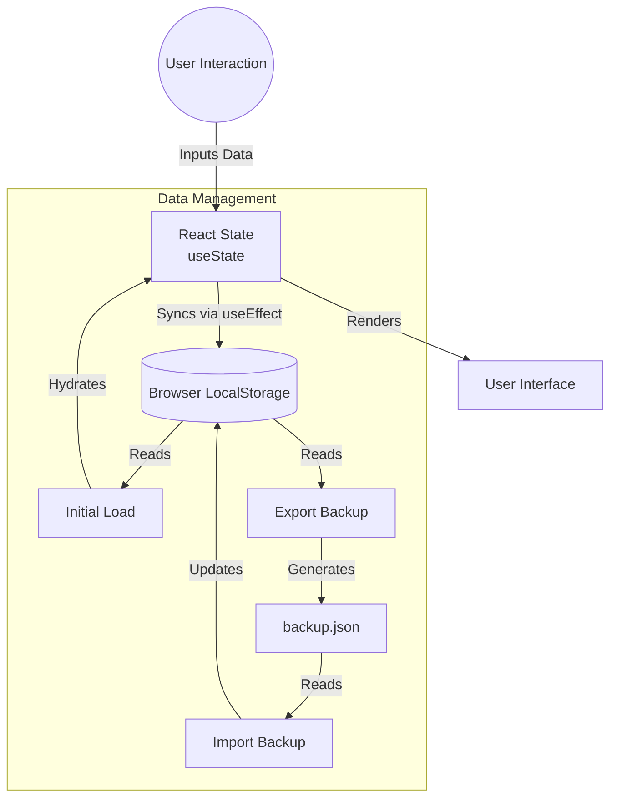

# Melo 📝✨  
### A Minimal, Offline-First Digital Journal for Mental Clarity  

---

## 👩‍💻 Basic Details

**Team Name:** Skye  

**Team Members:**  
- **Hima R** – LBS Institute of Technology for Women, Trivandrum  
- **Maria Tessa S E** – LBS Institute of Technology for Women, Trivandrum  

---

## 🌐 Hosted Project Link

🔗 [https://tink-her-hack-melo-1.onrender.com](https://tink-her-hack-melo-1.onrender.com)  
Deployed on **Render**  

---

## 📖 Project Description

Melo is a lightweight, privacy-focused digital journaling web application designed to help users reflect, process emotions, and build healthier mental habits — without login barriers, subscriptions, or distractions.  

It is an offline-first web app that ensures accessibility, simplicity, and a calm journaling experience.

---

## 🧠 Problem Statement

Talking about what feels wrong about you is hard.  

Self-care tools can be inaccessible or overwhelming.  

**Is your mind your biggest enemy?  
Taking care of your head shouldn’t be hard.**

In an era of constant digital stimulation, mental overload, and social media pressure, reflective practices like journaling are more important than ever. However, access to safe and simple digital tools for self-expression is often limited by:

- Mandatory account creation  
- Data privacy concerns  
- Internet dependency  
- Over-engineered platforms  

This disproportionately affects:

- Students in low-connectivity regions  
- Individuals concerned about data privacy  
- Users who cannot afford premium journaling apps  
- People seeking distraction-free digital spaces  

---

## 💡 The Solution

Melo addresses these challenges by being:

### 🔐 Privacy-First  
- No login  
- No tracking  
- No data collection  
- Entries remain stored locally on the user’s device  

### 🌐 Offline-Accessible  
After the initial load, Melo works without internet — making it usable in rural or unstable network environments.

### 🧘 Mental-Health Oriented  
By removing friction and complexity, Melo encourages daily reflection — a practice shown to improve:

- Emotional regulation  
- Stress management  
- Self-awareness  

### 📵 Digital Minimalism Advocacy  
Unlike attention-driven apps, Melo promotes intentional technology use rather than engagement addiction.

---

## 🌍 Why This Matters (Research-Backed)

According to the **[World Health Organization](https://www.who.int/)**, depression and anxiety disorders are among the leading causes of disability worldwide, especially among adolescents and young adults.

Research by psychologist **James W. Pennebaker** demonstrates that expressive writing:

- Reduces stress  
- Improves emotional processing  
- Enhances psychological resilience  
- Improves cognitive clarity  

Even short, structured journaling sessions have measurable mental-health benefits.  

By lowering barriers to journaling, Melo enables consistent self-reflection — an evidence-supported tool for emotional well-being.

---

## 🛠 Technical Details

### Languages
- JavaScript  
- HTML5  
- CSS3  

### Framework & Build Tool
- React  
- Vite  

### Tools
- Git & GitHub  
- VS Code  
- Deployment via Render  

---

## ✨ Features

- 📝 Create and edit journal entries effortlessly  
- 📖 View and revisit saved reflections anytime  
- 💾 Offline-first local storage ensures privacy and accessibility  
- ⚡ Fast, lightweight performance with Vite-optimized build  
- 📱 Fully responsive design for mobile and desktop  
- 🔒 Privacy-focused: no login, no tracking, no data collection  
- 🎨 Minimalist, clean, and aesthetically designed UI that reduces cognitive load and promotes calm reflection  

---


# 📄 Project Documentation

### For Software:


Screenshots (Add at least 3)
Screenshot 1-home screen


Screenshot 2- Picture journal and productivity tools interface

 Add caption explaining what this shows

Screenshot 3- Import/export from local storage space and provision for clearing the data


Diagrams

Application Workflow:


# 🏗️ System Architecture

**Melo** is built as a responsive, client-side Single Page Application (SPA). It prioritizes user privacy and simplicity by utilizing a **Local-First** architecture, meaning all data resides on the user's device and is not sent to an external server.

## 1. 🛠️ Tech Stack

- **Frontend Framework:** React.js (v18+)
- **Build Tool:** Vite (for fast HMR and optimized bundling)
- **Language:** JavaScript (ES6+) / JSX
- **Styling:** CSS3 with CSS Variables (Custom Sage Green Palette & Glassmorphism effects)
- **Icons:** Lucide React
- **Data Persistence:** Browser LocalStorage API
- **Deployment:** Render / Vercel

---

## 2. 🧩 Component Architecture

The application is structured around a modular component system to ensure maintainability and reusability.

### **Core Hierarchy**
- **`App.jsx`**: The root component that handles global state and routing between the Landing Page and the Main Dashboard.
- **`Landing.jsx`**: The initial "Music Player" style entry screen that sets the aesthetic tone.
- **`Dashboard.jsx`**: The main container that manages the navigation tabs (Daily, Self-Care, Habits, Budget, Dates).

### **Feature Modules**
1. **`JournalScrapbook`**: A grid-based layout containing individual "Card" components (`HappyMoments`, `ReflectiveTimes`) that accept text and image inputs.
2. **`HabitTracker`**: A dynamic table allowing users to toggle boolean states for daily habits.
3. **`BudgetManager`**: A reactive calculator that computes savings based on Income vs. Expenses inputs.
4. **`CalendarWidget`**: An interactive calendar for logging important dates and visualizing the month.
5. **`DataController`**: Handles the JSON serialization for the Export/Import backup functionality.

---

## 3. 🔄 Data Flow & State Management

Since Melo is serverless, the data flow relies heavily on React Hooks and the Browser Storage API.

### **Data Flow Diagram**



## 🎬 Video Demo


**Description:**  
This video demonstrates the core features of our project, including:  
- Key user flows and interactions  
- Technical highlights like Next.js frontend and Chrome extension integration  
- Local-first storage implementation for offline access  


https://github.com/user-attachments/assets/ef184db6-6985-4daa-ba0f-0ef35b48281f


---


## 🤖 AI Tools Used (Optional – Transparency Bonus)

If you used AI tools during development, document them here for transparency:

**Tool Used:** ChatGPT, GitHub Copilot,Gemini Pro

**Purpose:**  
- Generated boilerplate React components  
- Debugged async functions
- Provided optimization suggestions for code and queries  

**Key Prompts Used:**   
- "Debug this async function that's causing race conditions"  
 
**Percentage of AI-generated code:** ~20–30% (estimate)  

**Human Contributions:**  
- Architecture planning and component design  
- Custom business logic and API integration  
- UI/UX design, testing, and deployment  

*Note: Documenting AI usage shows transparency and can earn bonus points during evaluation.*

---

## 👥 Team Contributions
- **Maria Tessa S E:** Frontend development, React components, UI/UX design
- **Hima R:**  local-first storage setup, testing, deployment,UI/UX design  


---

## 📌 How to Run Locally
1. Clone the repository:  
   ```bash
   git clone <repo-link>
   cd <project-folder>
   
2. Install dependencies
   ```bash
   npm install
   
3. Run development server
   ```bash
   npm run dev

 ----  

## License

This project is licensed under the [LICENSE_NAME] License - see the [LICENSE](LICENSE) file for details.

**Common License Options:**
- MIT License (Permissive, widely used)
- Apache 2.0 (Permissive with patent grant)
- GPL v3 (Copyleft, requires derivative works to be open source)

---

Made with ❤️ at TinkerHub
